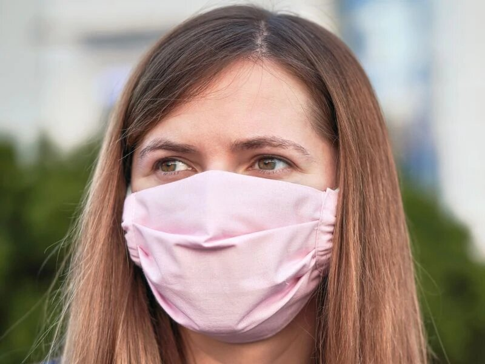
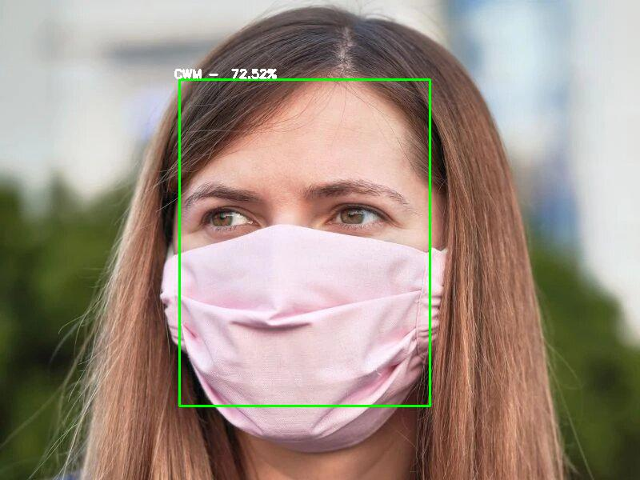
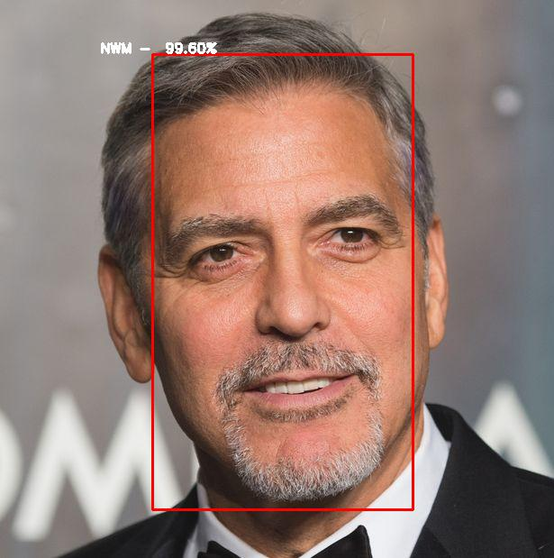

# Face mask detection

This repository contains the code to build a Convolutional neural network ([**RestNet50**](https://arxiv.org/abs/1512.03385)) to detect if a person is correctly wearing a mask (**CWM**), incorrectly wearing a mask (**IWM**) or not wearing a mask (**NWM**)

## Convolutional Neural Network and Residual Neural Network
In deep learning, a [Convolutional Neural Network](https://en.wikipedia.org/wiki/Convolutional_neural_network) (CNN or ConvNet) is a class of deep neural networks, most commonly applied to analyzing visual imagery. A CNN usually have multiple convolutional layers to extrac useful information from images.<br>A [Residual Neural Network](https://en.wikipedia.org/wiki/Residual_neural_network) (ResNet) is an artificial neural network (ANN) of a kind that builds on constructs known from pyramidal cells in the cerebral cortex. Residual neural networks do this by utilizing skip connections, or shortcuts to jump over some layers. Typical ResNet models are implemented with double- or triple- layer skips that contain nonlinearities (ReLU) and batch normalization in between.

## Prerequisites
All the necessary modules are listed in [`requirements.txt`](./requirements.txt). Create a virtual environment and install the modules
```
pip3 install -r requirements.txt
```
**MAKE SURE YOUR CPU SUPPORTS AVX INSTRUCTIONS THAT TENSORFLOW 2.3.1 USES IF YOU WANT TO RUN IT ON CPU**
## Dataset
The data was collected from various source
* [scraper](./scraper.py)
* [Google Drive](https://drive.google.com/drive/folders/1XDte2DL2Mf_hw4NsmGst7QtYoU7sMBVG) - see [here](https://github.com/chandrikadeb7/Face-Mask-Detection) for more info
* [MaskedFace-Net](https://github.com/cabani/MaskedFace-Net)

## ResNet50
ResNet50 is a residual neural network that is 50 layers deep. For this specific project the [ResNet50](./ResNet50.py) has additional few layers along with a [dropout](https://en.wikipedia.org/wiki/Dilution_(neural_networks)) layer to address overfitting. The input of the network is of size `224x224x3` and output is a dense layer of dimension `3x1` to predict between **CWM**, **IWM** and **NWM**. The network has a total of `23,850,371` parameters, of which `23,797,251` are trainable and `53,120` are fixed or non-trainable.<br>
The visual plot of the model architecture is shown [here](./ResNet50.png).

**After runnig it for 10 epochs the model got 98% accuracy on the test data**
## Usage
To clone the repo
```
git clone https://github.com/boop34/face-mask-detection.git
```
To get the `model.h5` you need to install [git-lfs](https://git-lfs.github.com/). Please refer to the link to learn more.<br>
To get the face detection model [cfg](https://github.com/sthanhng/yoloface/tree/master/cfg) and [weights](https://github.com/sthanhng/yoloface/tree/master/model-weights) refer to [here](https://github.com/sthanhng/yoloface).<br>
To set up the server, run [`app.py`](./app.py)
```
./app.py
```
or
```
python app.py
```
To use the client run [`detect_face_mask.py`](./detect_face_mask.py) with appropriate arguments, example
```
./detect_face_mask.py -i sample.jpg
```
and to learn more about the arguments run `detect-face-mask.py` without any arguments
```
./detect_face_mask.py
```
or with `-h` or `--help` option
```
./detect_face_ask.py --help
```
## Docker
To build a docker image of the server run the following command
```
docker build -t face_mask_detection .
```
Now to make a container run the following command to access the server on the default flask port 5000
```
docker run -p 5000:5000 face_mask_detection
```
otherwise to acces it on different port or to create multiple containers (for example: port 80, 81 and so on), make the adjustments in the [`detect_face_mask.py`](./detect_face_mask.py) as needed
```
docker run -p 80:5000 face_mask_detection
docker run -p 81:5000 face_mask_detection
```
there are various other things that can be done with docker, check their [official page](https://www.docker.com/) for more information.
## Example
Input Image                             |Output Image
:--------------------------------------:|:-------------------:
|
|
